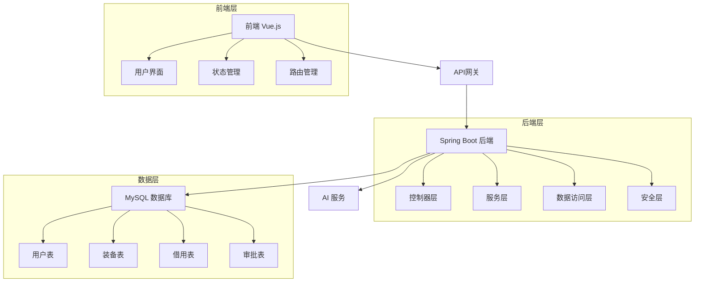

# 🏢 人员装备管理系统 (Personnel Equipment Management System)

<div align="center">
  
  
  
  
  
</div>

<p align="center">
  <strong>一个现代化的人员装备管理系统，集成AI智能助手，支持完整的装备生命周期管理</strong>
</p>

<p align="center">
  <a href="#-功能特色">功能特色</a> •
  <a href="#-技术架构">技术架构</a> •
  <a href="#-快速开始">快速开始</a> •
  <a href="#-项目结构">项目结构</a> •
  <a href="#-部署指南">部署指南</a> 
</p>

---

## 🎯 项目概述

人员装备管理系统是一个全功能的个人级管理平台，旨在为使用者提供学习，了解数据库的基本框架和实现方法

- **🚀 现代化技术栈**: 采用最新的Spring Boot 3.4.4 + Vue.js 3.5架构
- **🤖 AI智能助手**: 集成大语言模型，提供智能问答和操作指导
- **📊 数据可视化**: 丰富的图表和统计分析功能
- **🔒 安全可靠**: 基于JWT的安全认证和权限控制
- **📱 响应式设计**: 完美适配桌面和移动设备
- **⚡ 高性能**: 优化的数据库查询和前端渲染

---

## ✨ 功能特色

### 🔐 用户认证与权限管理
- **JWT令牌认证**: 安全的无状态认证机制
- **角色权限控制**: 细粒度的权限管理（管理员/普通用户）
- **个人中心**: 个人信息管理与头像上传
- **账户安全**: 密码修改与安全设置

### 📦 装备管理
- **全生命周期管理**: 装备从入库到维修的完整管理
- **智能分类**: 多级分类体系，支持自定义分类
- **高级搜索**: 多条件组合搜索与实时筛选
- **批量操作**: 支持CSV/Excel批量导入导出
- **智能预警**: 库存不足、维护到期等智能提醒

### 🔄 借用管理
- **在线申请**: 便捷的在线借用申请流程
- **多级审批**: 可配置的审批流程和权限
- **状态追踪**: 实时跟踪借用状态和进度
- **逾期管理**: 自动逾期提醒和处理
- **历史记录**: 完整的借用历史和统计

### 📊 数据统计与分析
- **实时仪表板**: 装备使用情况实时监控
- **多维度分析**: 借用频率、使用率、活跃度等分析
- **可视化图表**: 基于ECharts的丰富图表展示
- **自定义报表**: 灵活的报表生成和导出
- **趋势分析**: 历史数据趋势分析和预测

### 🤖 AI智能助手
- **智能问答**: 基于大语言模型的智能客服
- **操作指导**: 实时操作帮助和指导
- **问题诊断**: 智能问题诊断和解决建议
- **个性化推荐**: 基于使用习惯的个性化建议

---

## 🏗️ 技术架构

### 后端技术栈
<table>
<tr>
<td><strong>核心框架</strong></td>
<td>Spring Boot 3.4.4</td>
</tr>
<tr>
<td><strong>安全框架</strong></td>
<td>Spring Security + JWT</td>
</tr>
<tr>
<td><strong>持久层</strong></td>
<td>Spring Data JPA / Hibernate</td>
</tr>
<tr>
<td><strong>数据库</strong></td>
<td>MySQL 8.0</td>
</tr>
<tr>
<td><strong>API文档</strong></td>
<td>Spring Doc / Swagger</td>
</tr>
<tr>
<td><strong>工具库</strong></td>
<td>Jackson, Apache POI, OpenCSV</td>
</tr>
</table>

### 前端技术栈
<table>
<tr>
<td><strong>核心框架</strong></td>
<td>Vue.js 3.5.x</td>
</tr>
<tr>
<td><strong>状态管理</strong></td>
<td>Pinia</td>
</tr>
<tr>
<td><strong>路由管理</strong></td>
<td>Vue Router 4.x</td>
</tr>
<tr>
<td><strong>UI框架</strong></td>
<td>Element Plus + Bootstrap 5</td>
</tr>
<tr>
<td><strong>HTTP客户端</strong></td>
<td>Axios</td>
</tr>
<tr>
<td><strong>构建工具</strong></td>
<td>Vite 6.x</td>
</tr>
<tr>
<td><strong>图表库</strong></td>
<td>ECharts 5.x</td>
</tr>
</table>

### 系统架构图



---

## 🚀 快速开始

### 环境要求

确保您的开发环境满足以下要求：

| 工具 | 版本 | 说明 |
|------|------|------|
| JDK | 17+ | Java开发工具包 |
| Node.js | 16+ | JavaScript运行环境 |
| Maven | 3.8+ | 项目构建工具 |
| MySQL | 8.0+ | 数据库 |

### 📥 安装步骤

#### 1. 克隆项目
```bash
git clone https://github.com/yourusername/equipment-management.git
cd equipment-management
```

#### 2. 配置数据库
创建数据库并配置连接信息：

```sql
CREATE DATABASE equipment_db DEFAULT CHARACTER SET utf8mb4 COLLATE utf8mb4_unicode_ci;
```

修改 `src/main/resources/application.yml`：
```yaml
spring:
  datasource:
    url: jdbc:mysql://localhost:3306/equipment_db?useSSL=false&serverTimezone=UTC
    username: your_username
    password: your_password
    driver-class-name: com.mysql.cj.jdbc.Driver
  
  jpa:
    hibernate:
      ddl-auto: update
    show-sql: true
    properties:
      hibernate:
        format_sql: true
```

#### 3. 启动后端服务
```bash
# 安装依赖并启动
mvn clean install
mvn spring-boot:run

# 或者使用IDEA直接运行 Application.java
```

后端服务将在 `http://localhost:8081` 启动

#### 4. 启动前端服务
```bash
# 进入前端目录
cd ui

# 安装依赖
npm install

# 启动开发服务器
npm run dev
```

前端服务将在 `http://localhost:5173` 启动

#### 5. 访问系统
- 前端界面: http://localhost:5173
- API文档: http://localhost:8081/swagger-ui.html
- 默认管理员账户: admin/admin123

---

## 📁 项目结构

```
equipment-management/
├── 📁 src/main/
│   ├── 📁 java/dev/usr/database/
│   │   ├── 📁 config/           # 配置类
│   │   │   ├── JwtConfig.java
│   │   │   ├── SecurityConfig.java
│   │   │   └── SwaggerConfig.java
│   │   ├── 📁 controller/       # 控制器
│   │   │   ├── AuthController.java
│   │   │   ├── EquipmentController.java
│   │   │   └── BorrowController.java
│   │   ├── 📁 entity/           # 实体类
│   │   │   ├── User.java
│   │   │   ├── Equipment.java
│   │   │   └── BorrowRecord.java
│   │   ├── 📁 repository/       # 数据访问层
│   │   │   └── ...Repository.java
│   │   ├── 📁 service/          # 服务层
│   │   │   ├── impl/
│   │   │   └── ...Service.java
│   │   ├── 📁 security/         # 安全配置
│   │   │   ├── JwtAuthenticationFilter.java
│   │   │   └── JwtTokenProvider.java
│   │   └── 📁 payload/          # 请求/响应DTO
│   │       ├── request/
│   │       └── response/
│   └── 📁 resources/            # 配置文件
│       ├── application.yml
│       └── data.sql
├── 📁 ui/                       # 前端项目
│   ├── 📁 src/
│   │   ├── 📁 api/              # API调用
│   │   ├── 📁 components/       # 组件
│   │   ├── 📁 views/            # 页面
│   │   ├── 📁 router/           # 路由
│   │   ├── 📁 store/            # 状态管理
│   │   └── 📁 utils/            # 工具类
│   ├── 📁 public/               # 静态资源
│   ├── package.json
│   └── vite.config.js
├── 📁 docs/                     # 文档
│   ├── API.md
│   ├── DEPLOYMENT.md
│   └── CHANGELOG.md
├── 📁 scripts/                  # 脚本
│   ├── build.sh
│   └── deploy.sh
├── README.md
├── pom.xml
└── .gitignore
```

---

## 🔧 配置说明

### AI助手配置（可选）
在 `application.yml` 中配置AI服务：

```yaml
ai:
  config:
    enabled: true
    api-key: ${AI_API_KEY:your_api_key}
    api-url: https://api.openai.com/v1/chat/completions
    model: gpt-3.5-turbo
    max-tokens: 1000
    temperature: 0.7
```

### 文件上传配置
```yaml
spring:
  servlet:
    multipart:
      max-file-size: 10MB
      max-request-size: 10MB
      
file:
  upload:
    path: ./uploads/
    avatar-path: ./uploads/avatars/
```

### 邮件通知配置
```yaml
spring:
  mail:
    host: smtp.gmail.com
    port: 587
    username: your-email@gmail.com
    password: your-app-password
    properties:
      mail:
        smtp:
          auth: true
          starttls:
            enable: true
```

---

## 🐳 部署指南

### Docker部署

1. **构建Docker镜像**
```bash
# 构建后端镜像
docker build -t equipment-management-backend .

# 构建前端镜像
cd ui
docker build -t equipment-management-frontend .
```

2. **使用Docker Compose**
```yaml
version: '3.8'
services:
  mysql:
    image: mysql:8.0
    environment:
      MYSQL_ROOT_PASSWORD: rootpassword
      MYSQL_DATABASE: equipment_db
    ports:
      - "3306:3306"
    volumes:
      - mysql_data:/var/lib/mysql

  backend:
    image: equipment-management-backend
    ports:
      - "8081:8081"
    depends_on:
      - mysql
    environment:
      SPRING_DATASOURCE_URL: jdbc:mysql://mysql:3306/equipment_db
      SPRING_DATASOURCE_USERNAME: root
      SPRING_DATASOURCE_PASSWORD: rootpassword

  frontend:
    image: equipment-management-frontend
    ports:
      - "80:80"
    depends_on:
      - backend

volumes:
  mysql_data:
```

3. **启动服务**
```bash
docker-compose up -d
```

---

## 📚 API文档

### 认证相关
- `POST /api/auth/login` - 用户登录
- `POST /api/auth/register` - 用户注册
- `POST /api/auth/refresh` - 刷新token

### 装备管理
- `GET /api/equipment` - 获取装备列表
- `POST /api/equipment` - 创建装备
- `PUT /api/equipment/{id}` - 更新装备
- `DELETE /api/equipment/{id}` - 删除装备

### 借用管理
- `GET /api/borrow` - 获取借用记录
- `POST /api/borrow` - 创建借用申请
- `PUT /api/borrow/{id}/approve` - 审批借用申请
- `PUT /api/borrow/{id}/return` - 归还装备

完整的API文档请访问: `http://localhost:8081/swagger-ui.html`

---

## 📊 功能演示

### 系统截图

<details>
<summary>点击查看系统截图</summary>

**登录界面**


**装备管理**


**借用管理**


**数据统计**


**AI助手**


</details>

---

## 🧪 测试

### 运行单元测试
```bash
# 后端测试
mvn test

# 前端测试
cd ui
npm run test
```

### 运行集成测试
```bash
mvn verify
```

### 测试覆盖率
```bash
mvn jacoco:report
```

---

## 🔄 持续集成/持续部署

项目配置了完整的CI/CD流程：

- **GitHub Actions**: 自动化测试和构建
- **自动部署**: 标签发布时自动部署到生产环境
- **代码质量检查**: SonarQube代码质量分析
- **安全扫描**: 依赖漏洞扫描

